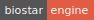

# The Biostar Engine

### Better solutions for an imperfect world.

The Biostar Engine is [Python 3.6][python] and [Django][django]based scientific data analysis oriented application server.

[python]: https://www.python.org/
[django]: https://www.djangoproject.com/

The Biostar Engine allows executing scripts over the web via graphical user interfaces.
In addition there is support for data storage and project management. The Biostar Engine can be used as simple LIMS (Laboratory Information Management Server)

These scripts may written in `bash`, `R` or any other a scripting enabled language.

We call these scripts as "recipes".

## Install

We recommend use [conda][conda] for setting up the site. For simplicity iur installation 
instructions rely on [conda][conda] (though many other alternatives would be also viable)

[conda]: https://conda.io/docs/

Create a virtual environment both on your system and on the remote site:

    conda create -y --name engine python=3.6
    source activate engine
    
Clone the source server code and the recipe code. These are kept separately.

    git clone git@github.com:biostars/biostar-engine.git
    git clone git@github.com:biostars/biostar-recipes.git
    
Install python dependencies.

    # Switch to the engine directory.
    cd biostar-engine
    
    # Install server dependencies.
    pip install -r conf/python_requirements.txt
    
    # The current package has packages that are needed at the command line.
    python setup.py develop
    
The following step is an optional [bioconda][bioconda] specific setup. 
Use it only if you also need and want to set up your tools via [bioconda][bioconda].

[bioconda]: https://bioconda.github.io/

    # Skip this step if you don't wish to run the tools 
    # that come with the engine.
    conda install --file conf/conda_requirements.txt
    
## Running the site

All commands run through `make`. A typical quistart start would be to do:

    make reset serve
    
Now visit <http://localhost:8080> to see your site running.

### Valid commands for `make`

Re-initializes the database:

    make reset 
 
Serve the current site:

    make serve

Get the data that are used in the demonstration recipes.

    make data
            
Loads example recipes from the `biostar-recipe` repository that you cloned in the setup.

    make recipes

Run all tests:

    make test
        
## Deployment

The site is built with Django hence the official Django documentation applies.

* <https://docs.djangoproject.com/>

The software also supports `uwsgi` as the runtime architecture. When deplying through 
`uwsgi` jobs are queued and run automatically through the `uwsgi` spooler. See the `uwsgi` documentation 
for details on how to control that process.

* <https://uwsgi-docs.readthedocs.io/en/latest/>

The jobs may also be started as commands. See the `job` command for details:

    python manage.py job --help
    
For example

    python manage.py job --next
    
will execute the first job in the queue.

## Recipes

Recipes are stored and distributed from a separate repository at:

* <https://github.com/biostars/biostar-recipes>

    

    
