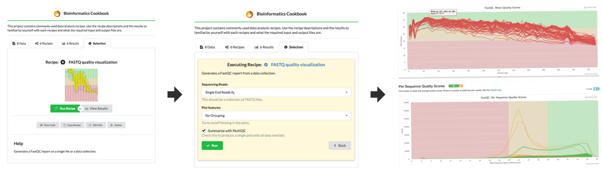

# The Biostar Engine

## Better Solutions for an Imperfect World

[python]: https://www.python.org/
[django]: https://www.djangoproject.com/

The Biostar Engine is a [Python][python] and [Django][django] based scientific data analysis oriented application server that can execute scripts over the web while providing a graphical user interface for selecting the parameters of these scripts. The scripts that the software executes may written for `bash`, may be a `Makefile`, `R` commands just about any program typically run from command line.

We call the scripts that the engine can execute as *recipes*. Recipes with bioinformatics orientation are maintained separately in the [biostar-recipes][recipes] repository.

[recipes]: https://github.com/biostars/biostar-recipes

The Biostar Engine also has support for data storage and project management and can be used as simple Laboratory Information Management System (LIMS). An actively maintained deployment of the software seen at:

* <https://www.bioinformatics.recipes>

## How does the site work?

More details on how the site works at:

* [How to use the site?][how-to-use]
* [How to write recipes?][how-to-write]

[how-to-use]: docs/how-to-use-the-site.md
[how-to-write]: https://github.com/biostars/biostar-recipes/blob/master/docs/how-to-write-recipes.md

## Installation

Our installation instructions rely on [conda][conda] though other alternatives are also viable. Users may use `virtualenv`, `homebrew`, `apt-get` just as well, or they may opt to not using any environment management tool.

1\. Create a virtual environment

[conda]: https://conda.io/docs/

    conda create -y --name engine python=3.6
    source activate engine
    
2\. Clone the source server code and the recipe code:

    git clone git@github.com:biostars/biostar-engine.git
    git clone git@github.com:biostars/biostar-recipes.git
    
3\. Install the python dependencies:

    # Switch to the biostar-engine directory.
    cd biostar-engine
    
    # Install server dependencies.
    pip install -r conf/python_requirements.txt
    
At this point the installation is complete.

4\. Start the server

All commands run through `make`. To initialize and run the test site use:

      make reset serve
   
Visit <http://localhost:8000> to see your site running. 

The default admin email/password combination is: `1@lvh.me/testbuddy`.  You may change these in the settings.

## Bioinformatics environment

To run bioinformatics tools the environment that the jobs are run in needs to be set up appropriately. The instructions makes use of [bioconda][bioconda] to install tools into the current environment. Make sure that you have enabled [bioconda][bioconda] prior to running the following:

    # Activate the environment.
    source activate engine
      
    # Switch to the engine directory.
    cd biostar-recipes
    
    # Install the conda dependencies.
    conda install --file conf/conda_requirements.txt

    # Add the recipes to the python path.
    python setup.py develop

[bioconda]: https://bioconda.github.io/

## Additional commands

The Makefile included with the engine contains additional commands.

Re-initialize the database:

    make reset 
 
Serve the current site:

    make serve

Get the data that are used in the recipes.

    make data
            
Initialize the example recipes from the `biostar-recipe` repository.

    make recipes

Run all tests:

    make test

## Deployment

The site is built with Django hence the official Django documentation applies.

* <https://docs.djangoproject.com/>

## Running jobs 

A recipe submitted for execution is called a job. When the job is run the recipe parameters (JSON dictionary) are applied onto recipe template. The result is the recipe script that gets executed. The transformation takes place at runtime.

Jobs can be executed as commands. See the `job` command for details:

    python manage.py job --help
    
The command has number of parameters that facilitate job management and recipe development.
For example:

    python manage.py job --list
    
will list all the jobs in the system. Other flags that allow users to investigate and override the behaviors.

    python manage.py job --id 4 --show_script
    
will print the script for job 4 that is to be executed to the command line. Other flags such as `-use_template` and `-use_json` allows users to override the data or template loaded into the job.
This can be useful when developing new recipes.

Another handy command:

    python manage.py job --next
    
will execute the next queued job. The job runner may be run periodically with cron.

## Job spooling

The Biostar Engine supports `uwsgi`. When deployed through 
`uwsgi` jobs are queued and run automatically through the `uwsgi` spooler. See the `uwsgi` documentation  for details on how to control that process.

* <https://uwsgi-docs.readthedocs.io/en/latest/>

[uwsgi]: <https://uwsgi-docs.readthedocs.io/en/latest/

## Recipes

Recipes are stored and distributed from a separate repository at:

* <https://github.com/biostars/biostar-recipes>

## Security considerations

**Note**: The site is designed to execute scripts on a remote server. In addition the site 
allows users with moderator rights may change the content of these scripts.

It is **extremely important** to monitor, restrict and guard access to all
accounts with moderator privileges!
