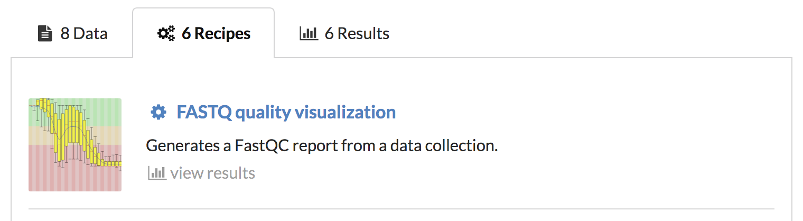
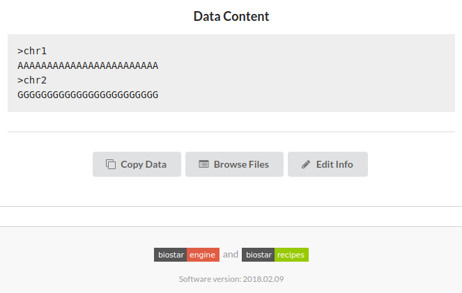

# How to use the website?

## Site organization

All content on the site is organized into *projects*.

A project is a collection of *data*, *recipes* and *results*.

Projects are typically created with a specific goal in mind and have content relevant to that goal.



Users may copy recipes and data across different projects.

## Site usage

The Biostar Engine is built to help executing data analysis pipelines. A typical usage would be:

1. Select a recipe
2. Select inputs for the recipe
3. Execute recipe
4. View the results


## Access rights

Projects may be `PUBLIC` this means everyone can see the content in them, or `PRIVATE` where only the owner and people selected by the project manager can access the project.

For `PRIVATE` projects access rights may have have different levels: `READ` and `READ + WRITE` or `READ + WRITE + MANAGE`. Thus a project owner may allow another users to see the data/recipes, or create new elements.

## How to tell what access rights you have?

If you can see a project it means to you have at least `READ ACCESS` to it.

Project that you have `WRITE ACCESS` to will have a thin green line under the project name. They will look similar to this:


This will help you immediately recognize what actions are allowable in a project.

For example if the green line is missing you won't be able to execute a recipe in that project. To execute the recipe you would first need to make a copy of it into a project that you do have `WRITE ACCESS` to. This will not give you your own version of the same recipe that you can use as is or modify.

## Create a project

You have full `READ + WRITE + MANAGE` access to projects that you create. So start by creating your own project.

To create a project, click the `Create Project` button found at the bottom of the `Project List` page.


This will open a form that allows you to name your project, optionally give it an image,  provide a description etc.

You may now populate your new project with recipes, data and you may allow other users to access your project.

## Create a recipe

The simplest way to create a recipe is to copy an existing recipe from another project.
We have a so called "Starter recipe" in the project named "How to create a recipe" you might want to use that as an example.

Visit a project that has recipes, select the `Recipes` tab, select the recipe of interest, then press the `Copy Recipe` button.

 

Now navigate to a project that you have created (or have write access to) then in the `Recipes` tab select the `Paste Recipe` button that is now visible to you.

Voila! You have your first recipe.

## Adding data into projects

There are different ways to add data to a project:

1. Upload data (there are limits on file size)
2. Copy data from another project
3. Import data produced as the result of running a recipe

There are no limits of the data sizes that the Biostar Engine can handle but there are limits to what you may upload via the web interface.

To get large datasets into the system we recommend a command line program described in the Biostar Engine documentation.

Data may be copied and imported across projects.

## Uploading data

To upload data by click the ```Upload File``` button found at the top of your data list page.


This will open a page allowing you to name your data, give it a type, etc.

There is a upload file size limit as well as a total upload limit for each user. These values depend on the particular settings of the server.

## Copy data

You may add data by copying data from other projects you have read access on .
   You can copy data by following these steps:

1\. Click on `Browse Files` to see the files


2\. Select the checkbox for the files you wish to copy the click `Copy Data`


3\. Navigate to the destination and click `Paste Data`

You can edit the information like name for each individual data entry, type, and description by clicking the `Edit Info` button found on the bottom of every data page.



## Data types

Each data has one or more types associated with it. These types are used to filter for
data with some properties when rendering the interface elements.

When a recipe specifies a type such as `FASTA` only data with type `FASTA` will be shown in the dropdown menu.

It is important to note that the site does not enforce the types, does not verify the formats. The types can be thought of as tags associated with files. You may choose to tag your data with custom types.

More than one type may be listed (comma separated): `FASTQ, COLLECTION`

The recipes in turn will apply a regular expression search on the types when filtering for the correct types.

You can specify a data type when uploading or afterwards by clicking `Edit Info` .

To change a type, you simply have to enter a string in the box labeled `Data Type`. Leaving it blank on upload will give the data a default type `DATA`.


## Add collaborators

To add collaborators , click ```Manage Access``` found on the bottom of your data list page.


That will take you to an access page that allows you to add collaborators by searching for them.


Only the project creator can grant `READ ACCESS` or `WRITE ACCESS` to other users.

* `READ ACCESS` Allows users to view and copy what they desire.  

* `WRITE ACCESS` Allows users to: import data, create and run recipes, and delete/edit what they create.

* `OWNER ACCESS` Given to user when creating a project. Allows them to delete/edit anything and revoke/grant access 


   

   
   
**Data Types**


## 3. Make your own recipes

If you have `WRITE ACCESS` or higher then you have the ability to create a recipe in one of two ways.

* Start from scratch

    To create a brand new recipe click on the ```Create Recipe``` button found at the bottom
    of your recipes list. 
    
    
    
    This opens a page that allowing you to name your recipe, give it a picture, etc. 
    
    Clicking `Save` will create a recipe with an empty template and json file, which you can edit by clicking `View Code`. 
    
   
* Copy and Paste existing recipes ( **Recommended** )

    You can copy data by following these steps:
    
     1. Go to a recipe of choice and right under the run button should be a `Copy Recipe` button.
     
     
     
     2. Click `Copy Recipe` and save it into your clipboard. 
      
     
      
    This is the simplest way of populating your project with recipes.
    
    You only need `READ ACCESS` to be able to copy a recipe, so public project like `The Biostar Cookbook` are treasure troves.
    
    After pasting the recipe you can edit the code by clicking `View Code`.
    
   
**Editing recipe code**

Editing recipe code is done by clicking `View Code`. 

   * Editing json and **sub-selecting for data types**
      
      Biostar-Engine knows to look for data if `source : PROJECT`. Furthermore, `display: DROPDOWN` for the interface to be  correctly generated.
      
      Here are simple examples that show how to sub-select:
      
      
          # Only show FASTA type in the dropdown
          { 
            name : Test
            source : PROJECT
            type : FASTA
            display: DROPDOWN
          }
          
          # Shows all data in a project
          { 
            name : Test
            source : PROJECT
            display: DROPDOWN
          }
    
         
   * Editing template
   
       Editing a template will result in the changes having to be reviewed and authorized by a staff member.
       
       For security reasons,a recipe with a changed template can not be executed without a staff member authorizing it. 
       
   
   


## 4. Running recipes

After modifying your recipe, you can finally use it to analyze some data. To do this, choose a recipe and click on the green ```Run``` button found at the top. 

This opens the interface page that allows you to specify parameters and execute a recipe.


Clicking `Run` on the interface page starts a job in a `Queued` state


* Authorization requirements

     1. You need `WRITE ACCESS` to the project
     2. Recipe needs to be reviewd by a staff if any changes have been made.
     
    
     

* Job states

     `Queued`    : Job is staged to run.
     
     `Spooled`   : Spooling directory has been made and script is ready to be ran.
   
     `Running`   : Job script is ran using bash.
   
     `Completed` : Job is successfully completed.
   
     `Error`     : Job is unsuccessfully completed.
   
     `Deleted`   : Deleted job not appearing in your list but your recycle bin.
   
     `Paused`    : Job is paused from its previous state. 
   
     `Restored`  : A once deleted job restored from the recycle bin. 

* Deleting and Editing jobs
   
   Deleting and editing jobs are actions only allowed to the creator of the job or project. 
   
   

* Gathering results

   In the same way you copy data, you can also copy result files 


## 5. Simple Demo


1. Create a project


2. Copy some data


3. Copy a recipe


4. Run recipe


5. Copy resulting files


