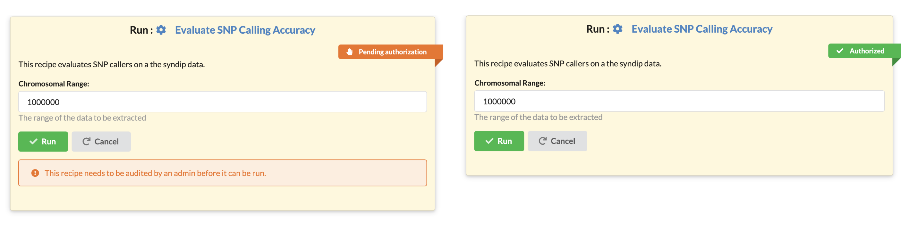

# FAQ - Frequently Asked Questions 

## Who can run a recipe?

To run a recipe, the recipe must carry the "approved" label, and the user must have "trusted" designation.  

## What is an approved recipe?

Since each recipe may contain console commands and other code, running recipes requires security checks to avoid misusing the computational resources. Every new recipe starts out in a so-called "non-approved" state labeled as such with an orange ribbon (see screenshot below).

A user with administrative privileges (a administrator) must approve a recipe for that recipe to become executable within the website.
A green ribbon decorates authorized recipes.

It is important to point out that un-approved recipes are visible, may be published, copied, shared, and downloaded by other users. 
The "approval" process merely indicates that a user with administrative privileges has assessed the recipe and believes it to be fit for the purpose.

## What is a trusted user?

Also, each user has a designation: "trusted" or "untrusted," that controls their ability to run recipes. 
Only users with "trusted" designation may run recipes.  The restrictions that we have in place provide high granularity control of the computational resources. 
The owner of the site decides which users and which recipes gain the privileges to use the computational resources. Other groups running the Recipes software may set up their system in such a way to automatically trust every new user that signs up, and they may also choose to approve every recipe that is created automatically. 

The software was designed with decentralization in mind. The Recipes software runs on any operating system: Linux, macOS and Windows 10 (with Linux Subsystem), and on any hardware that supports Python. 
We ran the Recipes on a MacBook Air laptop, on a single computer serving a lab, and on a high-performance multicore server. 
Installation takes little more than minutes and requires no special software, just the ability to run the Python programming language.  

We do envision different groups running their personalized instances of the software to serve local needs and have the ability to control who can run which recipe.

## Applicability as an educational tool.

Even though originally the platform was designed to provide bioinformatics support to our collaborators at the US Fish & Wildlife we have also found that the use of recipes integrates exceedingly well within bioinformatics curricula.
Specifically, when covering more advanced topics, educators present a series of commands that produce data analysis steps. Yet currently, there is no straightforward way to publish both the code and the results in one location. We can use say GitHub to publish code, but we can't use GitHub to execute the code, and we can't use GitHub to store large datasets either.
 In contrast, when using the Recipes site, a student can see both the code and all the files and results generated while running the code. In addition, they can also view results generated with different runtime parameters; all results are linked to the recipe that produced them.

Finally, students can readily copy the recipe over to their projects, make changes to it and see the results of their changes, all in the same interface. In that sense, the Recipes work a bit like Jupyter notebooks. 

## It is conceptually most similar to Galaxy, but how does it differ? 

When compared to Galaxy the Recipes framework presents several fundamental differences in its operating principles:

The Recipes framework was designed to capture entire data analysis pipelines. The Galaxy framework was designed to represent individual software tools.
The code downloaded from the Recipes framework can be run on any other computer (that has the software installed) and will produce the same output as seen on the web. 
A Galaxy analysis can only be run inside the Galaxy software. Recipes are designed to be shared and expanded upon by various users. 
Users may create different interfaces for recipes copied from someone else. The end-user cannot change interfaces in Galaxy.
The Recipes framework is also a data analysis know-how and training material distribution framework. 

## What are the advantages of the recipes over Galaxy? 

One major advantage, in our opinion, is the independence of the method from the platform. 
A bioinformatics recipe is an independent piece of code that teaches and trains bioinformatician how to perform the analysis themselves either on the Recipes website or on their own computational infrastructure. 
The code obtained from the Recipes website is similar to code they would develop at the command line.

Another perhaps even more important benefit is the ability to build upon other users' know-how. 
Any user may take an existing multistage analysis and add/remove/customize that analysis for their needs. 

## If you have a local Galaxy server and a local Recipe instance - what functional differences do users see? 

It is possible to set up recipes that look and behave like tools in Galaxy. 
For example, if one were to wrap individual tools into recipes, then from the usability perspective, Galaxy and Recipes would be nearly identical. 
In that sense, the Recipes website is a superset of some of Galaxy's functionality. 
That being said, this is not how we envision using the Recipes, we advocate building pipelines rather than individual tools, a model that is not directly applicable in Galaxy.

## How does the performance compare? 

We believe that the performance of Recipes software is excellent. 
The Recipes code runs Python 3 and Django, both we documented platforms with extensive use in the software industry. 
The Recipes software runs on more platforms than Galaxy, and we believe that it is faster and simpler to bootstrap. 
Galaxy targets different use-cases and supports different needs; thus it would be unwise for us to state that our site is either more or less performant than Galaxy - since it does something else. 
What we can say is that the performance of the software we wrote that never introduces a bottleneck itself. 

When it comes to the performance of the analyses themselves, that depends on the infrastructure that runs the server.

## This application is designed to serve individual groups, but groups on what scale? 

Django, the application server that our application is built upon has wide acceptance in the software industry. 
Django runs platforms such as Pinterest and Instagram. 
Thus we believe that software can be made to scale up to support computing at a supercomputer scale.

Our current focus, based on the priorities of the funding that we have recieved, was to develop a service that serves groups consisting of dozens of bioinformaticians serving, say hundreds of end-users.

## Can it cope with multiple users, for example, what are the minimum requirements for installing the web application?

The Recipes software itself has extremely-low memory and CPU overhead. 
We estimate a few hundred megabytes and less than 1% CPU utilization. 
Of course, when we run an analysis, the resource utilization depends on the tasks in the study itself - what is important to note is that our software imposes minimal overhead. Any limitation would only manifest with respect of the demands of running analyses. There are few constraints for the number of users that can access/read/share/ copy recipes. Hundreds of thousands of users could be browsing the recipes with millions of page views every month.

## How new recipes are deployed and added to the system and where (and how) recipes actually run when you execute them through the web application. 

The recipes are currently executed on the same platform that runs the webserver. 
Upon set up, site owners can customize how many jobs they want to allow to be run simultaneously. 
The Recipes software comes with a built-in job queuing system that will honor this setting. 
Thus site owners can set up more or fewer simultaneous job queues depending on their computational resources.

Recipes are created in two ways: either as new recipes by selecting the "Create recipe" button or by "copying" or "cloning" an existing recipe (we provide the explanation for the two terms in the next answer).

## If different people are developing recipes, how do you standardise the way the recipes are created? 

This problem is both important yet somewhat of a challenge to implement in a way that is not overbearing and limiting yet maintains utility to the users. 
We have chosen the model described below, but we are open to suggestions from our community and may revisit the implementation later. 
For that reason, we would rather maintain this information in the main documentation rather than in the publication itself as it is possible that later on, our implementation changes.

### Every recipe that a user may access can be duplicated in a new project as a "clone" or as a "copy".

A cloned recipe remains in sync with the original recipe that it was cloned from. 
Clones cannot be changed and track the original recipe. A change to the original recipe will immediately be reflected in all the clones. 
The purpose of a cloned recipe is to ensure that a recipe is the same across multiple projects and individuals. 

The second method to duplicate a recipe is to copy it. A copied recipe is a brand new recipe filled with the content from an existing recipe. 
When a recipe is copied the provenance to the original recipe is not maintained. It becomes the responsibility of the author of the recipe to maintain the relevant information in the documentation of the recipe. 

## What conventions should be followed, how should they be documented, what is the minimum amount of provenance that the scripts should produce, and how should that be presented to the users?

Choosing the appropriate levels of documentation and provenance is a difficult question that we still debate and discuss. 
We would like to avoid being either too lax or too stringent. The concepts that we popularize in this tool are new; the approach is different from past models. 
In the paragraphs above, we discuss many of the challenges that we face. 

We do plan to evolve our views as needed. Currently, we chose to approve only the recipes where the documentation is appropriate, and provenance is properly noted. 
Hence the "approved" state of a recipe is a manually curated process. We hope that with time, as we better understand the standards and requirements, we will be able to automate the process.
