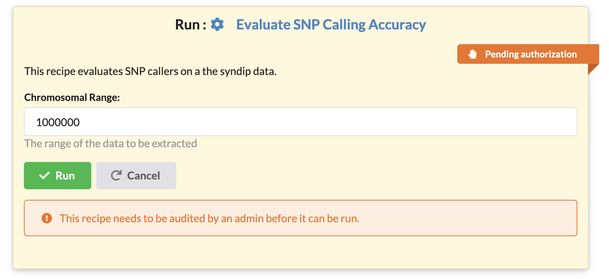
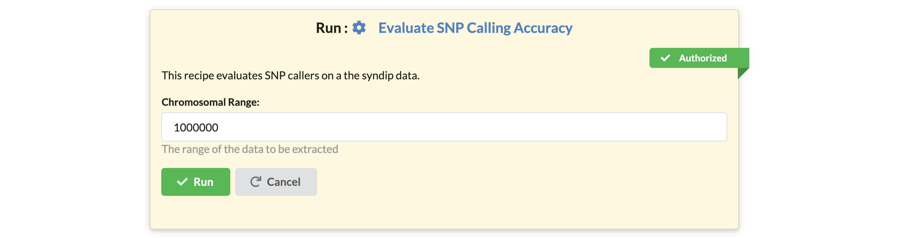
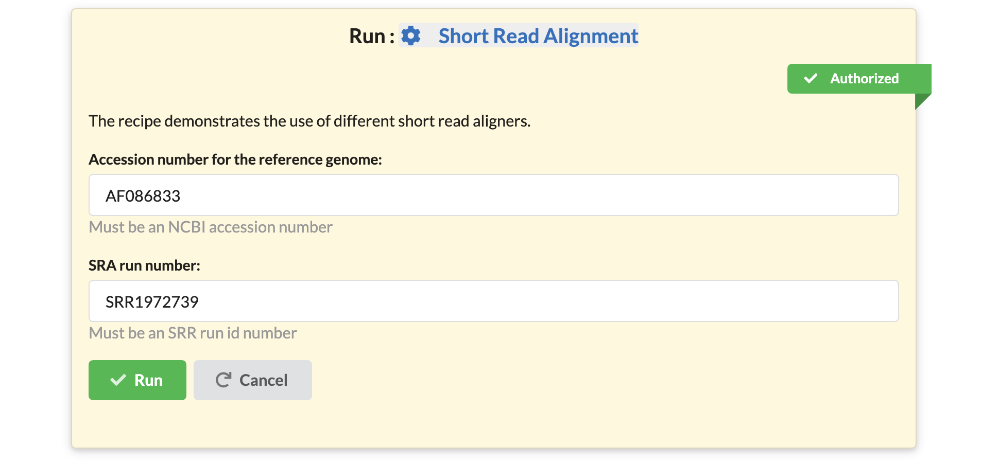
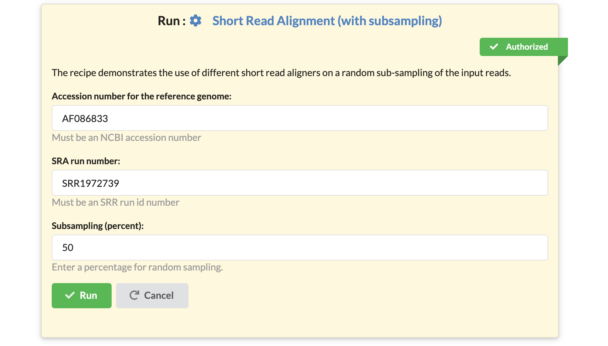

# FAQ - Frequently Asked Questions

## Answers to reviewers

We created this section to answer questions reviewers posed while reviewing our scientific publication.

### Who can run a recipe?

To run a recipe, the recipe must be **authorized**, and the user must have **trusted** designation.

### What is an authorized recipe?

Since a recipe may contain shell commands and other code, security checks are needed to avoid the misuse of computational resources. Every new recipe starts in a so-called **pending authorization** state, displayed with an orange ribbon. A recipe with **pending authorization** cannot be executed on the website, but it may be inspected, viewed, shared, or downloaded.

A user with administrative privileges (an administrator) must approve a recipe in the recipe edit window for the recipe to become executable within the website. A green ribbon decorates authorized recipes.

### Who is a trusted user?

Each user has a designation: **trusted** or **visitor** that controls their ability to run recipes.  only users with **trusted** designation may run **approved** recipes.

### How do I become a trusted user?

The site administrators can change the designation of any user.

The restrictions that we have in place provide high granularity control of the computational resources.

The owner of the site decides which users and which recipes gain the privileges to use the computational resources. Other groups running the Recipes software may set up their system in a manner to automatically trust every new user that signs up, and they may also choose to approve every recipe that is created automatically.

### How can I tell if I am a trusted user?

Users can find out what their designation is by looking at their user name in the menubar.

Each type of user gets different icons. These icons are used to indicate their designation.

### Will this software run on my machine?

The software was designed with decentralization in mind. The software runs on any operating system: Linux, macOS and Windows 10 (with Linux Subsystem), and on any hardware that supports Python. We routinely run the software on a MacBook Air laptop, on a single computer serving a lab, and on a high-performance multicore server.

Installation takes little more than minutes and requires no special software, just support for the Python programming language.  We do envision different groups running their personalized instances of the software to serve local needs.

### Is the software useful in bioinformatics education?

Even though initially the platform was designed to provide bioinformatics support to our biologist collaborators, we have found that the use of recipes integrates exceedingly well within bioinformatics curricula.

Specifically, when covering more advanced topics, educators typically present a series of commands that demonstrate a chain of data analysis steps. Currently, there is no straightforward way to publish both the code and the results, all in one location. We can use say GitHub to publish code, but we can't use GitHub to execute the code, and we can't use GitHub to store large datasets either.

 In contrast, when using Bioinformatics Recipes, students can see both the code and all the files and results generated while running the code. In addition, they can also view results generated with different runtime parameters; all results are linked to the recipe that produced them.

Finally, students can readily copy the recipe over to their projects, make changes to it and see the results of their changes, all in the same interface. Then they can download the recipes onto their systems and run the recipe within their environments.

### The software seems conceptually most similar to Galaxy, but how does it differ?

When compared to Galaxy, the Recipes framework presents several fundamental differences in its operating principles:

1. The code downloaded from the site can be run on any other computer (that has the software installed) and will produce the same output as seen via the web interface.
1. A Galaxy analysis only runs inside the Galaxy software. Recipes are designed to be shared and expanded upon by various users.
1. Users may create different interfaces for recipes copied from someone else. The end-user cannot change interfaces in Galaxy.
1. The framework is also a data analysis know-how, social interaction, and training material distribution framework.

### What are the advantages of the recipes over Galaxy?

One significant advantage, in our opinion, is the independence of the method from the platform.

A bioinformatics recipe is an independent piece of code that educates and trains bioinformatician how to perform the analysis themselves on any computational platform. The code may be run either on the Recipes website or on any other computational infrastructure. The code obtained from recipes is identical to the code a bioinformatician would develop at the command line.

Additionally, the platform also serves as a knowledge distribution. Users can build upon each others' know-how and expertise. A user may take an existing multistage analysis and add/remove/customize that analysis for their needs.

### If you have a local Galaxy server and a local Recipe instance - what functional differences do users see?

It is possible to set up recipes that look and behave like tools in Galaxy. For example, if one were to wrap individual tools into recipes, then from the usability perspective, Galaxy and Recipes would be very similar.

In that sense, the Recipes website is a superset of some of Galaxy's functionality. Let us point out that the described approach is not how we envision using the Recipes. We advocate building pipelines rather than running separate tools, a strategy that is not directly applicable in Galaxy.

Finally, users may also choose to build different interfaces for the same data analysis pipeline. Users may choose to customize additional parameters. For example, suppose a user publishes a recipe that runs a short read aligner with default settings on a hardcoded fraction (say 25%) of a data:

Another user may take the same recipe, keep the same code for it, but create a different interface. They may choose to expose the subsampling percentage as a parameter:

By building on the work of another scientist, the user was able to create another pipeline, that now offers the extra functionality that they needed.

### How does the performance compare?

Our framework uses Python 3 and was built with the [Django][django] application server, a well-documented platform with extensive use in the information technology industry. Django runs platforms such as Pinterest, Instagram, and many others.  [Django][django] as an application development platform is well documented. Knowing Django is also a valuable skill that adds to the marketability of bioinformaticians.

When it comes to the performance of the analyses themselves, these depend on the choice of methods and on the infrastructure that runs the server.

[django]: https://www.djangoproject.com/

### This application is designed to serve individual groups, but on what scale?

Django, the application server that our application uses has wide acceptance in the information technology industry. We believe that the software can be made to scale up to support computing at a supercomputer scale.

Our current focus, based on the priorities of the funding that we have received, was to develop a system that serves groups consisting of dozens of bioinformaticians interacting with hundreds of end-users.

Note how the limitations would occur only at the level of running simultaneous analyses. There are no constraints for the number of users that can access/read/share/copy/customize/download recipes. Hundreds of thousands of users could be browsing the recipes with millions of page views every month.

### What are the minimum requirements for installing the web application?

The bioinformatics recipes software itself has extremely-low memory and CPU overhead. We estimate a few hundred megabytes and less than 1% CPU utilization.

Of course, when we run an analysis, the resource utilization depends on the tasks in the processes that are employed - what is important to note is that our software imposes minimal overhead.

### Where (and how) recipes actually run when you execute them through the web application?

The recipes are currently executed on the same platform that runs the webserver. Since the service itself has minimal overhead, the entire computational infrastructure is available for computation.

The Recipes web application comes with a built-in job queuing system that can be customized for a desired amount of parallelism. Site owners can set up more or fewer simultaneous job execution strategies depending on their computational resources.

The architecture of the server is modular. We do foresee adding a job runner that integrates with job queuing systems like PBS or SLURM.

### How are new recipes added to the system?

Recipes get created in two ways: either from *scratch* by selecting the "Create recipe" button or by "copying" or "cloning" existing recipes. We describe the processes in more detail in other answers in this FAQ.

### How do you standardise the way the recipes are created?

The problem of standardization is essential yet somewhat of a challenge to implement in a way that is not overbearing and limiting while maintaining utility to the users.

We have chosen the model of **cloning** and **copying** as described below, but we are open to suggestions from the community and may revisit the implementation later.

### What is a "cloned" recipe?

When pasting a copied recipe, we may paste it as a clone.

A cloned recipe remains in sync with the original recipe that it was cloned from. Clones cannot be changed and track the original recipe. A change to the original recipe will immediately be reflected in all the clones. The purpose of a cloned recipe is to ensure that a recipe is the same across multiple projects and individuals.

### What is a "copied" recipe?

When pasting a copied recipe we may paste it as a new recipe.

Another method for duplicating a recipe is to copy then paste it as a new recipe. A copied recipe is a new, original recipe filled with the content from an existing recipe.

When a recipe is pasted as new, the provenance to the original recipe is not maintained. It becomes the responsibility of the author of the recipe to maintain the relevant information in the documentation of the recipe.

### What conventions should be followed? How should they be documented? What is the minimum amount of provenance that the scripts should produce? How should that be presented to the users?

Determining the appropriate levels of documentation and provenance is a difficult question that we still debate and discuss.

We would like to avoid being either too lax or too stringent. The concepts that we popularize in this platform are new; the approach is different from past models.

We do plan to evolve our views as needed. Currently, we chose to approve only the recipes where the documentation is appropriate, and provenance is properly noted. Hence the "approved" state of a recipe is a manually curated process that indicates a higher level of standard. We hope that with time, as
