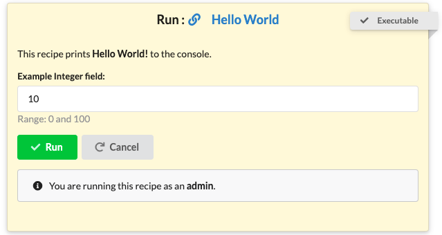

# General Concepts

## What is a recipe?

A **recipe** can be thought of as a standalone data analysis script that runs in a computing environment.

Recipes are mounted onto a web application that allows bioinformaticians to publish and execute data analysis workflows. 

We call these workflows **bioinformatics recipes**.   A recipe may be a collection of several command-line tools, it may be a Makefile, it may be an R script or a Python program.  

We designed our framework such that just about any series of commands may be formatted and published as a recipe. In addition, the application that we have developed can generate a graphical user interface to each recipe, thus facilitates user interaction and parameter selection at runtime.

## Who can execute recipes?

Recipes can only be executed by a select group of users.

The user groups allowed to execute recipes are:
- **Admins** - site administrators with super user privileges.
- **Trusted users** - select users trusted to run recipes. 

## How are recipes standardized?

Recipes are standardized by requiring two ingredients to be executable:
1. The interface specification file.
2. The template specification file.

Recipes are require two ingredients to be executable. 
Once executed, a recipe produces metadata results consisting of a snapshot of all the 
commands, script parameters, messages and files that have been generated during the run.

In addition, the results are viewable via the web interface.

## Where do recipes run?

Currently, recipes are executed on the system housing the source code. 
This can be changed so recipes are submitted as jobs in remote servers.  

## Conventions when creating recipes

## Documenting recipes

## Provenance that recipes produce

Cloning provides the ability to synchronize a recipe

### Presenting the recipe provenance 

## How does Bioinformatics Recipes compare to Galaxy
The recipe approach is similar to Galaxy in that it serves non-technical audiences. 
Additionally, just like Galaxy, recipes are presented with an automatically generated graphical user interface to facilitate their use. 
The main difference from Galaxy is that recipes are not built around individual software tools; instead, 
recipes are complete analyses scripts consisting of multiple steps and stages. 

 

### Advantages 
In addition, every recipe is downloadable and executable as a standalone program.
Thus, recipes can be run without the web service and may be reused within different platforms and contexts. 
Notably, in our recipe approach, the roles are more separated and distinct than in Galaxy.

### Functional differences seen by users
In our typical use cases, bioinformaticians develop and test the analysis code at the command line, then they turn their code into recipes and share them with all collaborators. 
Once shared via the website, collaborators can then select parameters and execute a recipe using data of their choice. 
Collaborators may inspect, copy, and modify the recipe code.

### Performance comparison 

## Scaling to larger users

