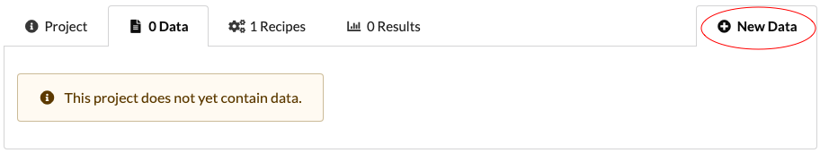

# Projects

The platform is project based. Each project is a collection of data, recipes and results.

Thus each project has three distinct sections:

1. The data.
2. The recipes.
3. The results.

The location of the media directory can be found in `biostar/settings.py` under the variable `MEDIA_ROOT`

## Privacy

Projects can be `Private`, `Public`, or `Sharable`.

- `Public` - viewable to everyone
- `Private` - viewable by collaborators
- `Sharable` - actively shared amongst a set of users

## How are project directories structured ?

Each project has a physical directory associated on the system located in the media
directory. 

The general directory structure for a project with 1 data, and 2 results would look like:

    media/
        projects/
            first project/
                first data/
        jobs/
            first result/
            second result/
       
        tocs/
            first data table of content.txt
            ... 

Data that exists on a filesystem may be linked into from the command line. 
This means that no copying/moving of data is required. 
The only limitation is that of the filesystem.
 

## Create a project

Creating a project can be done using the command line or web interface. 
Ensure you have a local server running or have access to a remote one when using  the web interface.

### Using command line

Use the management command `project` to create a project from command line.

    $ python manage.py project --help
    
    usage: manage.py project [-h] --pid PID [--name NAME] [--info INFO] [--public]
                         [--update] [--version] [-v {0,1,2,3}]
                         [--settings SETTINGS] [--pythonpath PYTHONPATH]
                         [--traceback] [--no-color] [--force-color]

    Creates a project.
    
    optional arguments:
      -h, --help            show this help message and exit
      --pid PID             Project id
      --name NAME           Project name
      --info INFO           File path or text of the project info
      --public              Makes project public
      --update              Updates the project selected by pid
      
      ...
   
      
To create a sample project, run the following:

    python manage.py project --name sample project --public --info "This is a sample" --uid sample
      

### Using web interface

Click on the `New Project` tab circled on the right. 

This will bring you to a form to fill in the name, privacy, information, etc...

# Access Management

In addition to checking the , before any actions a user takes on the web interface, their project access is checked.

Access level are:

Read:

- Clone and copy recipe
- Read and copy data
- Read and copy results
- Create and edit their own recipes

Share:

- Includes all permission in `Read Access`
- Activated using a sharable project link

Write:

- Includes all permission in `Read Access`
- Upload new data 
- Delete objects
- Edit all recipes in projects
- Add or remove collaborators to the project 

Recipes can be misused so running them requires more privileges.

**Admins**,**staff**,and **trusted users** can run recipes with read or write access.

## Granting Access

Adding collaborators can be done using the command line or the interface. 
Ensure you have a local server running or have remote when using the web interface.

### Using command line

To add a user using command line use the managment command `add_user`:

    $ python manage.py add_user --help --fname user_file.csv

    usage: manage.py add_user [-h] [--fname FNAME] [--version] [-v {0,1,2,3}]
                              [--settings SETTINGS] [--pythonpath PYTHONPATH]
                              [--traceback] [--no-color] [--force-color]
    
    Add users
    
    optional arguments:
      -h, --help            show this help message and exit
      --fname FNAME         The CSV file with the users to be added. Must have
                            headers: Name, Email
    

With a sample csv file `user_list.csv` that looks like :

    user 1,  user1@email
    user 2,  user2@email

You can run the following command using the file:

    python manage.py add_user --fname user_list.csv
    
    
### Using web interface 

Click on the `Info` tab to view the project menu bar.

Click on the middle button labeled `Manage Access` 

 Search for users and select the access you would like. to give them

# Data

## Data Types

## Upload data

Data can be added multiple ways.

Web interface options:
  - Upload a file
  - Write text
  - Import directory
  
Command line options:
  
  - Link any file in the file system
  
### Using command line

You can use the management command `data` to add or edit `Data` objects.

    $ python manage.py data --help 
    
    usage: manage.py data [-h] --pid PID [--did DID] [--update] [--path PATH]
                      [--text TEXT] [--name NAME] [--type TYPE] [--version]
                      [-v {0,1,2,3}] [--settings SETTINGS]
                      [--pythonpath PYTHONPATH] [--traceback] [--no-color]
                      [--force-color]

    Adds data to a project
    
    optional arguments:
      -h, --help            show this help message and exit
      --pid PID             Select project by unique uid
      --did DID             Select data by unique uid
      --update              Update the table of content for data --did.
      --path PATH           Path to the data to be added (file or directory)
      --text TEXT           A file containing the description of the data
      --name NAME           Sets the name of the data
      --type TYPE           Sets the type of the data
    
    

Link a sample directory, `/path/to/data/`q, to an existing project,  `project one`:

    
    $ python manage.py data --pid project one --path /path/to/data/ --name New data

### Using web interface

Open the `Data` tab inside of a project. 

Then click on the `New Data` tab on the right. 

This opens another a form with two options.

1 . **Upload a file** -  Comes with size restrictions that come be found in the `settings.py` 

2 .  **Write text** - 10k character limit 

    

## Import directory

Admin, staff, and trusted users can see an extra tab labeled `Import Data`

