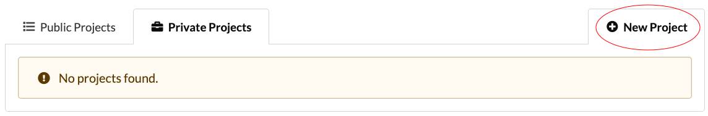

# Projects

The platform is project based. Each project is a collection of data, recipes and results.

Thus each project has three distinct sections:

1. The data.
2. The recipes.
3. The results.

The location of the media directory can be found in `biostar/settings.py` under the variable `MEDIA_ROOT`

## Privacy

Projects can be `Private`, `Public`, or `Sharable`.

- `Public` - viewable to everyone
- `Private` - viewable by collaborators
- `Sharable` - actively shared amongst a set of users

## How are project directories structured ?

Each project has a physical directory associated on the system located in the media
directory. 

The general directory structure for a project with 1 data, and 2 results would look like:

    - media/
        - projects/
            - first project/
                - first data/
        - jobs/
            - first result/
            - second result/
       
        - tocs/
            - first data table of content.txt
            ... 

Data that exists on a filesystem may be linked into from the command line. 
This means that no copying/moving of data is required. 
The only limitation is that of the filesystem.
 

## Create a project

Creating a project can be done using the command line or web interface. To use the web interface, ensure 
you have a local server running or have access to a remote one.

### Using command line

Use the management command `project` to create a project from command line.

    $ python manage.py project --help
    
    usage: manage.py project [-h] --pid PID [--name NAME] [--info INFO] [--public]
                         [--update] [--version] [-v {0,1,2,3}]
                         [--settings SETTINGS] [--pythonpath PYTHONPATH]
                         [--traceback] [--no-color] [--force-color]

    Creates a project.
    
    optional arguments:
      -h, --help            show this help message and exit
      --pid PID             Project id
      --name NAME           Project name
      --info INFO           File path or text of the project info
      --public              Makes project public
      --update              Updates the project selected by pid
      
      ...
   
      
To create a sample project, run the following:

    python manage.py project --name sample project --public --info "This is a sample" --uid sample
      

### Using web interface

**Note** : Ensure your web server is running, locally or remotely. 

Click on the `New Project` tab circled on the right. 

This will bring you to a form to fill in the name, privacy, information, etc...

# Access Management

In addition to checking the , before any actions a user takes on the web interface, their project access is checked.

Access level are:

    Share Access: 
        - clone/copy recipe
        - Read/copy data
        - read/copy results
        - Create/edit their own recipes
     
    Read Access:
        - clone/copy recipe
        - Read/copy data
        - read/copy results
        - Create/edit their own recipes
     
    Owner/Write Access:
        - clone/copy/edit/create recipes
        - Read/copy/upload data
        - read/copy/ results
        - Edit all recipes in projects
        - Add contributors to the project 

    Admins, Staff, Trusted users:
        - Execute recipes with read or write access
        
Recipes can be misused so running them requires more privileges.

**Admins**,**staff**,and **trusted users** can run recipes with read or write access.

## Giving Access

Access to project To use the web interface, ensure 
you have a local server running or have access to a remote one.

### Using command line

### Using web interface 

# Data

## Create data

### Using command line

### Using web interface

## Import directory

