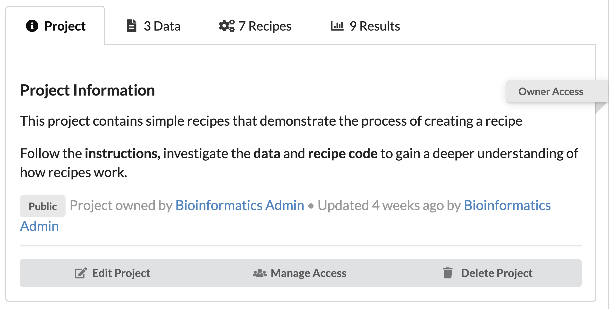
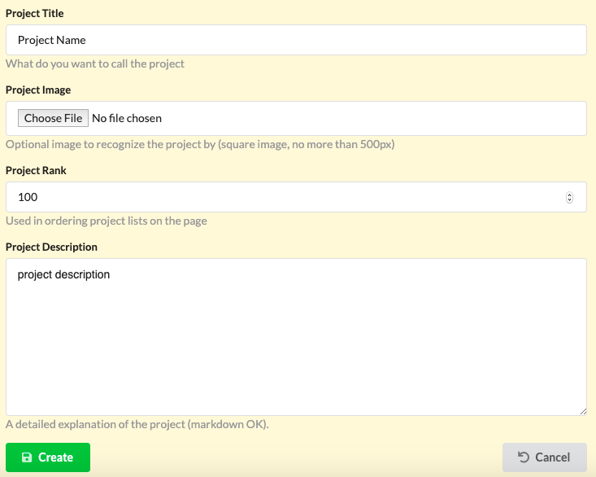
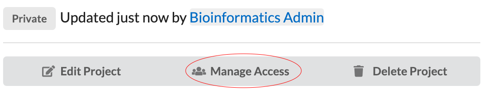
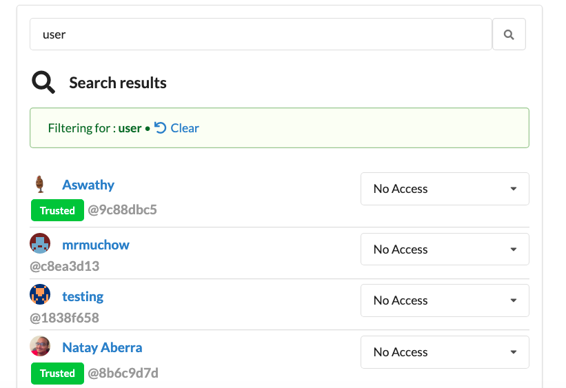
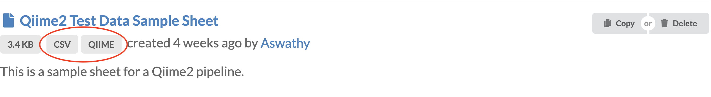
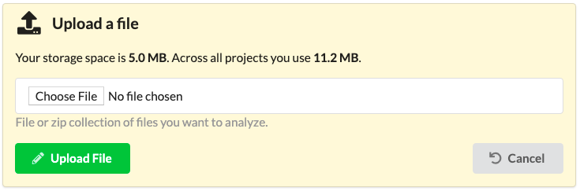

# Projects

The platform is project based. Each project is a collection of data, recipes and results.

Thus each project has three distinct sections:

1. Data - the input files.
2. Recipes - the code that processes the data.
3. Results - the directory that contains the resulting files of applying the recipe to data.

## Project Privacy

Within the management interface, all content is grouped into projects that may have public or private visibility. 
Content stored in public projects is readable without restrictions. 
Private projects will restrict access to members only.

1.  Public - viewable to everyone
2.  Private - viewable to collaborators
3.  Sharable - actively shared amongst a set of users

## Create a Project

Click on the `New Project` tab circled on the right. 

This will bring you to a form to fill in the name, privacy, information, etc...

## Project Access

The web application provides a transparent and consistent framework to conduct analyses that can be shared among collaborators or with the public.

Recipes, data and results can be copied across projects, users may create new projects and may allow others (or the public) to access the contents of a project. 

Access level and their respective permissions are:

Public:
- Clone and copy recipes.
- Read and copy data.
- Read and copy results.

Read:

- Clone and copy recipes.
- Read and copy data.
- Read and copy results.
- Create and edit their own recipes.
- _Trusted users_ : can run recipes.

Users without read access are informed of their restrictions when trying to create a recipe.

Trusted users without read access to a recipe are also informed of their restrictions when trying to run it.
 

Share:

- Includes all read access permissions.
- Activated using a sharable project link

Write:

- Includes all read access permissions.
- Can upload data 
- Can delete objects from project.
- Can edit all recipes in the project.
- Add or remove collaborators to the project 

Users that try to edit a recipe without write access are informed of their limitations in this project with:

Users without write access that try to upload data or delete objects are informed of their restrictions using a message.

 
 

## Granting Access

Click on a project and open the first tab. 

Click on the middle button labeled `Manage Access` 

Search for users using their username, uid, or name. You can select their 

# Data

Data may be uploaded or may be linked directly from a hard drive or from a mounted filesystem, thus avoiding copying and transferring large datasets over the web.  
For recipes that connect to the internet to download data, for example when downloading from the `Short Read Archive` the data does not need to be already present in the local server.

Notably the concept of “data” in our system is broader and more generic than on a typical file system. 
In our software “data” may be a single file, it may be a compressed archive containing several files or it may be a path to a directory that contains any number of files as well as other subdirectories. 
The programming interfaces for recipes can handle directories transparently and make it possible to run the same recipes that one would use for a single file on all files of an entire directory. 

## Data Types

Data types are labels (tags) attached to each data that help filtering them in dropdown menus. More than one data type may be listed as comma separated values.
The data types may be any word (though using well recognized names: BED, GFF is recommended).

## Upload Data

Data can be added multiple ways.

Web interface options:
  - Upload a file
  - Write text
  - Import directory
  

Open the `Project` tab inside of a project. 

Then click on the `Add Data` button

This opens another a form with two options.

1 . **Upload a file** -  Comes with size restrictions that can be found in the `settings.py` 

2 .  **Write text** - 10k character limit 

    

## Import Directory

Admin, staff, and trusted users can see an extra tab labeled `Import Data`

