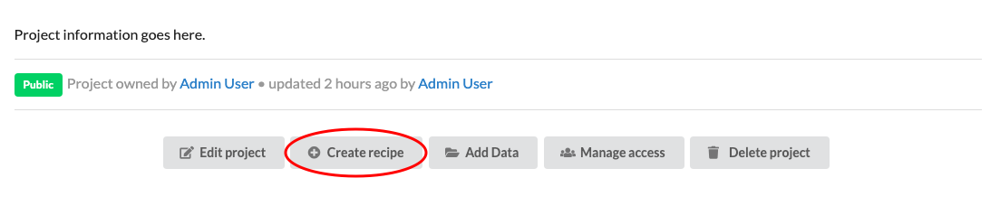
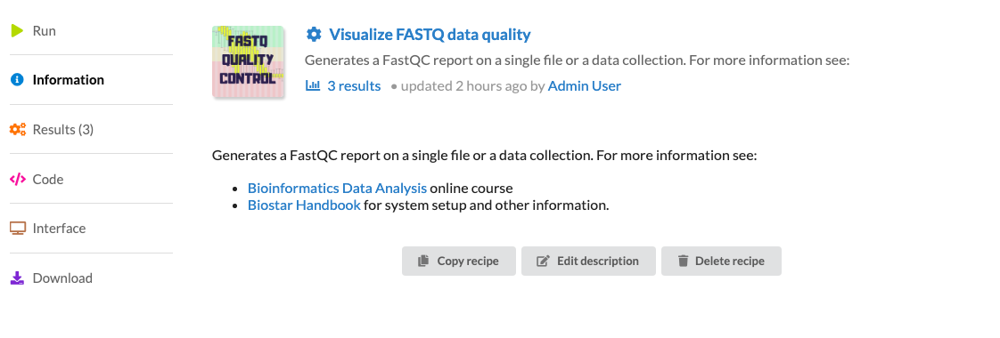
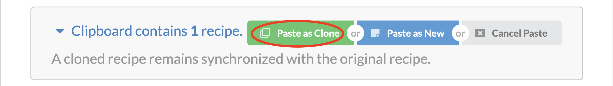
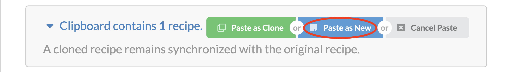
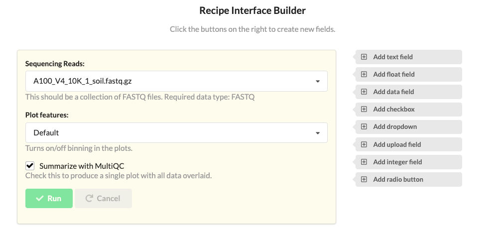

# Recipes

## Recipe Ingredients

Each recipe is built from two ingredients:

1. The interface specification file.
2. The template specification file.

The **interface** will specify the value of the parameters that get substituted into the **template**.

The **template** contains the commands that need to be executed. The **template** will have
placeholders for the parameter values that the user will need to enter in the interface.

The interface + template will generate a script that the site can execute.

The software will generate an web interface for each parameter specified in the interface. It is this interface where users are able to select the values that their recipe needs to operate.


A recipe consists of a "TOML definition file" and a "script template".

The simplest TOML definition file is an empty file and a simple script template might contain just:

    echo 'Hello World!'


The **Results** are created by applying a **Recipe** on **Data**.

## Create a Recipe 

Creating a recipe can be done using the command line or web interface.

Web interface:

- Create a brand new recipe.
- Clone or copy one from another project.

### Brand New Recipe
Users have the option of creating a brand new recipe or copying/cloning one from an existing one.

To create a brand new recipe, click on the `Project` tab located on the left and find the `Create Recipe` button.

 

This takes you to the following page.

 


### Copy or Clone

After clicking `Copy` the recipe is in your clipboard. Open the `Recipe` tab of any project to view your clipboard.

Once your clipboard has recipes, you can  **clone** or **copy** them.
 
Cloning allows your recipes to stay up to date with an original source. 

**Note** You can clone with `Read Access` and edit the cloned recipe with `Write Access` to the original.

A cloned recipe remains in sync with the original recipe that it was cloned from. 
Clones cannot be changed and track the original recipe. A change to the original recipe will immediately be reflected in all the clones. The purpose of a cloned recipe is to ensure that a recipe is the same across multiple projects and individuals.

To paste the recipes as a clone, click the `Paste as clone` at the top of the `Recipes` tab.


The second method to duplicate a recipe is to copy it. A copied recipe is a brand new recipe filled with the content from an existing recipe. 
When a recipe is copied the provenance to the original recipe is not maintained. It becomes the responsibility of the author of the recipe to maintain the relevant information in the documentation of the recipe. 

To paste the recipes as a new one, click the `Paste as New` at the top of the `Recipes` tab.



## Interface Specification 

The TOML definition file lists the parameters and allows the interface to be rendered.
Here is an example TOML definition file:

```
[reads]
value = "FASTQ Data Collection"
label = "Sequencing Reads"
type = "FASTQ"
source = "PROJECT"

[group]
label = "Plot features"
display = "DROPDOWN"
choices = [ [ "default", "Default",], [ "nogroup", "No Grouping",],]
value = "default"
help = "Turns on/off binning in the plots."

```
Each recipe parameter will have an automatic attribute called `value` that contains either the selected value (if  the parameter is user supplied) or the default `value` found in the interface specification file.

the parameter name is `foo`, the default value is `World!`. The `display` field specifies the type of the HTML widget, the `label` and  `help` fields describe the interface. The interface generated from this specification file looks like this:


## Interface Builder
One of the useful features in our web interface is the **interface builder**. 
We found building interfaces to be the most cumbersome process in the recipes workflow so we created a feature that would build the specification file for you.





## Data Field

A "data" unit in the `recipes` app is a directory that may contain one or more (any number of files).

### Data value

Each recipe parameter will have an automatic attribute called `value` that contains either the selected value (if  the parameter is user supplied) or the first file from the `table-of-contents`. For data consisting of a single file one may use the value directly.

    fastqc {{reads.value}}

### Table of Contents

Each recipe parameter will have an automatically generated attribute called `toc` (table of contents) that returns the list of the file paths in the data.

The file paths are absolute paths. The `toc` can be used to automate the processing of data. For example
a data directory named `reads` contains several FASTQ files with `.fq` extensions. To run `fastqc` on each file that matches that
the recipe may use:

    cat {{reads.toc}} | grep .fq | parallel fastqc {}

### Data Source

When a recipe parameter indicates the source of the parameter as `PROJECT` it will be populated from the data in the project that matches the type.

    [reads]
    value = "FASTQ Data Collection"
    label = "Sequencing Reads"
    type = "FASTQ"
    source = "PROJECT"


Only data that matches the tage `FASTQ` will be shown in the dropdown menu.

### Data Types

Data types are labels (tags) attached to each data that help filtering them in dropdown menus. More than one data type may be listed as comma separated values.
The data types may be any word (though using well recognized names: BED, GFF is recommended).

Data that exists on a filesystem may be linked into the Biostar Engine from the command line. 
This means that no copying/moving of data is required. 
The only limitation is that of the filesystem.


## Recipe Template

A recipe is a script that has template markers for filling in parameters. In the case for the `foo` variable above, we can access its value via:

    echo 'Hello {{foo.value}}'

Recipes are using [Django templates][templates] and may contain Django template specific constructs.

When the recipe is run the template will be substituted according to the interface value entered by the user. If the default value is kept it will produce the script:

    echo 'Hello World!'

## Recipe Execution

Before executing the recipe the script template is rendered with the JSON data and is filled into the template.

    template + TOML -> script

The script is then executed at the command line.

The recipe execution creates a `Result` objects.

## Job Runner

The platform users an asynchronous task scheduler to execute the recipes in the background. 
The site admins has control on how many workers are spawned and how many are used to run recipes.


# Results

Results consists of all files and all the metadata created by the recipe as it is executed on the input data. 
 
Each run of a recipe will generate a *new* result directory. 
Users may inspect, investigate and download any of the files generated during the recipe run. 
Additionally, users may copy a result file as new data input for another recipe. 


[templates]: https://docs.djangoproject.com/en/2.2/topics/templates/

## Output Directory

Once the recipe runs a results directory is created that contains the following:

- the code for the recipe
- the standard out and error stream content
- all files created by the recipe

The results directory is a snapshot of all files generated when the recipe has been run, including the recipe itself.

## Rerun Results

