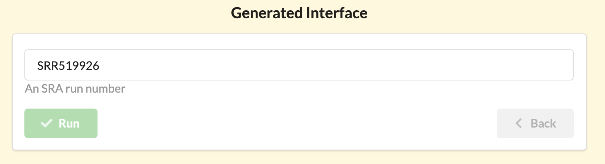

# Recipes


Each recipe is built from two ingredients:

1. The interface specification file.
2. The template specification file.

The **interface** will specify the value of the parameters that get substituted into the **template**.

The **template** contains the commands that need to be executed. The **template** will have
placeholders for the parameter values that the user will need to enter in the interface.

The interface + template will generate a script that the site can execute.

The software will generate an web interface for each parameter specified in the interface. It is this interface where users are able to select the values that their recipe needs to operate.


A recipe consists of a "JSON definition file" and a "script template".

The simplest JSON definition file is

    {}

A simple script template might contain just:

    echo 'Hello World!'


The platform is project based. Each project is a collection of data, recipes and results.

Thus each project has three distinct sections:

1. The data.
2. The recipes.
3. The results.

The **Results** are created by applying a **Recipe** on **Data**.


## Create a recipe 

Creating a recipe can be done using the command line or web interface.

Command line options:
- Directly upload recipe json and template

Web interface options:

- **Clone a recipe** - Remains synchronized with original recipe. Changes are carried over from the original.

- **Copy a recipe** - Create a new of a recipe that is a direct copy of another.


### Using the command line

Use the `recipe` management command to directly add to a project.

    $ python manage.py recipe --help
    
    usage: manage.py recipe [-h] --pid PID --rid RID [--json JSON]
                        [--template TEMPLATE] [--info INFO] [--name NAME]
                        [--image IMAGE] [--update] [--version] [-v {0,1,2,3}]
                        [--settings SETTINGS] [--pythonpath PYTHONPATH]
                        [--traceback] [--no-color] [--force-color]

    Adds recipe to a project

    optional arguments:
      -h, --help            show this help message and exit
      --pid PID             Project id.
      --rid RID             Recipe id.
      --json JSON           Recipe json path.
      --template TEMPLATE   Recipe template path (optional)
      --info INFO           Recipe description (optional)
      --name NAME           Recipe name
      --image IMAGE         Recipe image path
      --update              Updates the recipe


For example, the command below would add a recipe named `New recipe` to project with uid `project 1`.

    python manage.py recipe --pid project 1 --name New recipe --json < interface file > --template < script template > 


### Using the web interface

Open on a recipe of interest and click on the `Copy` button on the menu bar.


After clicking `Copy` the recipe is in your clipboard. Open the `Recipe` tab of any project to view your clipboard.

Once your clipboard has recipes, you can  **clone** or **copy**.

1. Cloning 

Cloning allows your recipes to stay up to date with an original source. 

**Note** You can clone with `Read Access` but you can only edit the cloned recipe with `Write Access` to the original.

To clone the recipes in your clipboard, click the `Paste as clone` at the top of the `Recipes` tab.


2. Copying 

Copying creates recipes with the same specifications as the ones in the clipboard.

To copy the recipes , click the `Paste as new` at the top of the `Recipes` tab.


## Interface file 

The JSON definition file lists the parameters and allows the interface to be rendered.
Here is an example JSON definition file:

```
{
  foo: {
    label: Enter the name
    help: The name to appear after the greeting
    display: TEXTBOX
    value: World!
  }
}
```

the parameter name is `foo`, the default value is `World!`. The `display` field specifies the type of the HTML widget, the `label` and  `help` fields describe the interface. The interface generated from this specification file looks like this:




## Interface Builder
One of the useful features in our web interface is the `Interface Builder.` 


Every interface option is in this dropdown and 

## Data Field

A "data" unit in the `recipes` app is a directory that may contain one or more (any number of files).

### Data value

Each recipe parameter will have an automatic attribute called `value` that contains either the selected value (if  the parameter is user supplied) or the first file from the `table-of-contents`. For data consisting of a single file one may use the value directly.

    fastqc {{reads.value}}

### Table of contents

Each recipe parameter will have an automatically generated attribute called `toc` (table of contents) that returns the list of the file paths in the data.

The file paths are absolute paths. The `toc` can be used to automate the processing of data. For example
a data directory named `reads` contains several FASTQ files with `.fq` extensions. To run `fastqc` on each file that matches that
the recipe may use:

    cat {{reads.toc}} | grep .fq | parallel fastqc {}

### Source

When a recipe parameter indicates the source of the parameter as `PROJECT` it will be populated from the data in the project that matches the type.

    reference: {
        label: Reference Genome
        display: DROPDOWN
        type: FASTA
        source: PROJECT
    }

Only data that matches the tage `FASTA` will be shown in the dropdown menu.

### Types

Data types are labels (tags) attached to each data that help filtering them in dropdown menus. More than one data type may be listed as comma separated values.
The data types may be any word (though using well recognized names: BED, GFF is recommended).

Data that exists on a filesystem may be linked into the Biostar Engine from the command line. 
This means that no copying/moving of data is required. 
The only limitation is that of the filesystem.


## Template

A recipe is a script that has template markers for filling in parameters. In the case for the `foo` variable above, we can access its value via:

    echo 'Hello {{foo.value}}'

Recipes are using [Django templates][templates] and may contain Django template specific constructs.

When the recipe is run the template will be substituted according to the interface value entered by the user. If the default value is kept it will produce the script:

    echo 'Hello World!'


## Code Builder


# Run a recipe


## Execution

Before executing the recipe the script template is rendered with the JSON data and is filled into the template.

    template + JSON -> script

The script is then executed at the command line.

The recipe execution creates a `Result` objects.


# Results


[templates]: https://docs.djangoproject.com/en/2.2/topics/templates/

## Output directory

Once the recipe runs a results directory is created that contains the following:

- the code for the recipe
- the standard out and error stream content
- all files created by the recipe

The results directory is a snapshot of all files generated when the recipe has been run, including the recipe itself.


## The job runner

# Examples

## 1. Example - Empty Recipe

The simplest recipe is empty for both the **template** and the **data**.

* https://www.bioinformatics.recipes/recipe/view/empty-recipe/

Even though it performs no action it is a valid and working recipe. Its purpose is to demonstrate what takes place when a recipe is run. The results of running the empty recipe are here:

* https://www.bioinformatics.recipes/job/view/a53f6057/

**Note: You need to be a trusted user to run a recipe**. Admin users automatically have this permission on every project.  If you don't have this permission you
can still see the results that this recipe produces but you would not be able to run the recipe.

Note how even an empty recipe produces outputs. These are files named as follows:

- `recipe.sh` file is the script that executed after being generated from the template.
- `runlog/input.json` file contains the data that was used in the template.
- `runlog/stdout.txt` file contains the output messages that the recipe produced.
- `runlog/stderr.txt` file contains the error messages that the recipe produced.

The contents of `stdout.txt` and `stderr.txt` are also visible on the result page.

## 2. Example - Hello World

Let's write a recipe that prints "Hello World" to the screen.

* https://www.bioinformatics.recipes/recipe/view/hello-world/

In this recipe the template contains the following:

    # This is a regular bash script.

    echo 'Hello World!'

The recipe is a bash script that prints "Hello World" to the screen. The results of running this recipe can be seen here:

* https://www.bioinformatics.recipes/job/view/3e365b2c/

Note that the words "Hello World" also appear on the "Output Messages" tab and are contained in the file called `stdout.txt`

* https://www.bioinformatics.recipes/job/serve/3e365b2c/runlog/stdout.txt

Make a new recipe and add the following into it:

## 3. Examples - Download FASTQ data by SRA number

Suppose we wish to create a recipe that downloads and unpacks FASTQ data from the short read archive.
The code we wish to deploy is:

    # The SRR run number.
    SRA=SRR519926

    # Download 1000 reads from SRA.
    fastq-dump --split-files -X 1000 $SRA

but we want to make the selection of the SRA number controllable by the user.

We start by copying over any other existing recipe. Start with the "empty recipe" for example.

Find the "Interface link"  it is in `More -> Interface` then paste the code above into the template section. Click "Preview" to see what the code will look like, in this case since the code does not have any modifiable region it will look the same after the preview.

Save this recipe. You have recipe that works on one specific SRA number. If that is all you wanted you would be done with the recipe.

To make the input overrideable we need to add the following to the Interface JSON section (this might be already filled out to some default settings. Replace all that with:

    {
        settings: {

        }

        sra: {
            value: SRR519926
        }
    }

All data objects are dictionaries. The `settings` key is internal. The `sra` key is a parameter to the script. To access this parameter from the script change the template to

    # The SRR run number.
    SRA={{ sra.value }}

    # Download 1000 reads from SRA.
    fastq-dump --split-files -X 1000 $SRA

Note here that we access the value of the parameter `sra` with ``{{sra.value}}``.

If you preview your recipe again you will see that it produces the same output as before. The value is filled into the script automatically.

But the interface is still empty as the site does not yet know how to render a graphical widget to the parameter. To tell the site how to render the parameter expand the interface JSON to look like this:


    {
        settings: {

        }

        sra: {
            display: TEXTBOX
            value: SRR519926
            help: An SRA run number
            regex: \w{1,9}$
        }
    }

## Tutorial recipes

See the url below for a number of recipes of increasing complexity:

* https://www.bioinformatics.recipes/recipe/list/tutorials/

## Resources

Visit the recipes website and see the various example recipes:

* https://www.bioinformatics.recipes/

